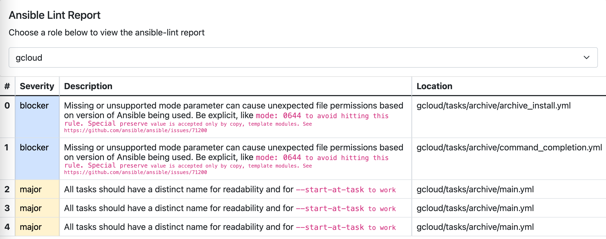

# Ansible Lint Reporter

This playbook automates the process of linting a group of roles and generating a basic UI to search through the reports.

## Variables

### General

| Name | Default | Description |
| ---- | ------- | ----------- |
| ansible_lint_reporter_content_src_type | directory | Source of roles content: `directory|ado` |
| ansible_lint_reporter_root_dir | /tmp/ansible-lint-reporter | Roles content destination - if using `directory` override this var |
| ansible_lint_reporter_roles_glob | * | Optional fileglob for focusing on roles content within the **ansible_lint_reporter_root_dir** |
| ansible_lint_reporter_root_dir_excludes | reports | Optional exclusion filter for identify roles in **ansible_lint_reporter_root_dir** |

### Azure DevOps

| Name | Default | Description |
| ---- | ------- | ----------- |
| azure_devops.organization | --- | Azure DevOps organization |
| azure_devops.project | --- | Azure DevOps project |
| azure_devops.key_file | --- | SSH key file used to authenticate with Azure DevOps |
| ado_personal_access_token | --- | PAT used to interact with Azure DevOps REST API |

## Setup

1. [Install Ansible](https://docs.ansible.com/ansible/latest/installation_guide/intro_installation.html)
1. Clone this repo
1. Choose roles content source
    - **Directory**
        - Use existing directory containing roles or place roles in a desired location
        - Override **ansible_lint_reporter_root_dir**
    - **Azure DevOps**
        - Determine project with repositories representing Ansible Roles
        - Override azure_devops vars: **organization**, **project**, **key_file**
        - Currently the playbook is setup to clone all repos in a project - modify this behavior in [tasks/azure_devops.yml](tasks/azure_devops.yml)

## Usage 

1. Run the playbook!
    - **Directory**
        - `ansible-playbook main.yml -e ansible_lint_reporter_root_dir=/custom/directory`
        - `ansible-playbook main.yml ... -e ansible_lint_reporter_roles_glob=ansible-role-*`
    - **Azure DevOps**
        - `ansible-playbook main.yml -e @ado_vars.yml -e @secret_vars.yml`
        - Define azure_devops vars in ado_vars.yml and sensitive vars in secret_vars.yml
1. Open the report
    - Mac: `open dist/index.html`
    - General: navigate to dist and click on index.html to open in default browser